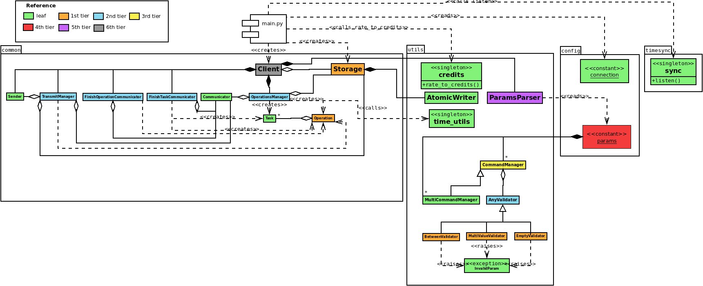

# Class diagram

In this diagram, a "leaf" class is one which does not reference any other class (asides from standard or third party libraries). First tier classes reference only leaf classes; second tier classes reference at least one first tier class. N-th tier classes reference at least one (N-1)-th tier class. This is a way to visualize the impact of changes. The higher the tier, the less classes will be impacted by the change.

## Class responsibilities:

### `common` package

* **Client**: Receive operation requests from an instance of pladmed-backend (server), and orchestrate helper objects in order to execute said operations and send their results to the server via a web socket connection.

* **Communicator**: Message bus for the client's concurrent helper objects.

* **FinishOperationCommunicator**: Listens for operation finished messages (which come from `scripts/measure.py`), and forward them to the Communicator in order to process them.

* **FinishTaskCommunicator**: Listens for task finished messages (which come from `scripts/measure.py`), and forward them to the Communicator in order to process them.

* **Operation**: Model a traceroute/ping/dns operation, with its parameters, status, cost in credits and execution cadence.

* **OperationsManager**: Listen to operation requests via Communicator. When requests are received, schedule them to run via `scripts/measure.py` and to stop execution via `scripts/stopper.py` in crontab. On startup, recover operation state if necessary.

* **Sender**: Send operation results to a pladmend-backend instance using a web socket connection. Uses a lock to avoid concurrency issues when sending.

* **Storage**: Wrapper over file system as an intermediate state and results store. If the client crashes, it can resume operation from the last saved state. Writes are perfomed atomically to avoid concurrency issues.

* **Task**: An operation is made up of tasks; a task encapsulates a single call to a measuring tool.

* **TransmitManager**: Ensure that results were correctly received by server (waits for an ACK).

### `config` package

* **connection (constant)**: Application configuration constants. They define max uploading retries, and storage directories.

* **operations.params (constant)**: Define parameters for each kind of operation (traceroute, ping and dns), and how to validate each of them.

### scripts packages

* **measure (script)**: Perform the actual measurement which had been scheduled via crontab. When a task (single call) is completed, notify the app via socket. When the operation is completed (all calls done), notify the app via socket.

* **stopper (script)**: Remove a specific operation from crontab, so that it's not executed again.

### `timesync` package

* **sync (module)**: Listen on a local socket for sync requests. When one arrives, synchronize container clock (to avoid changing the host's clock) with configured NTP server.

* **trigger (script)**: Send a sync notification to the local socket where the app is listening for sync requests. This is done like this because this script is fired from crontab, which runs outside the application context.

### `utils` package

* **AnyValidator**: Base abstract class.

* **BetweenValidator**: Extends `AnyValidator`; validates that a command value is inside a specific range. Requires values to be orderable.

* **AtomicWriter**: Write data to file system safely, concurrency wise.

* **CommandManager**: Orchestrate command parsing and validation.

* **credits (module)**: Convert data rate to credits. This is used on startup to calculate the client's maximum credits.

* **EmptyValidator**: Extends `AnyValidator`; validates that no value is provided. This is useful for switch-like commands, which do not require values.

* **InvalidParam**: Extends `Exception`. This is raised by validators (classes that extend `AnyValidator`) when validation fails.

* **MultiCommandManager**: Extends `CommandManager` in order to handle multi-valued commands such as IPs.

* **MultiValueValidator**: Extends `AnyValidator`; validates that value is in a set of predefined values.

* **ParamsParser**: Defines how to parse operation parameters. For fqdns, name resolution is invoked in order to convert them to IP parameters. This saves the overhead of performing DNS resolution over and over.

* **time_utils (module)**: Date and time manipulation helper functions, to decide if an operation is over, and to generate its stop time.