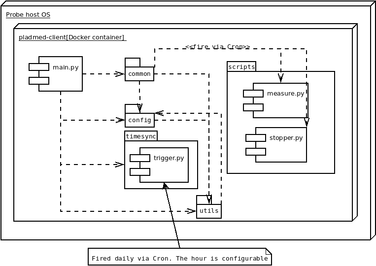

# Packages diagram

## Package responsibilities:

* **common**: Contains the core functionality; namely, scheduling measurements via Cron, receiving the results and uploading them to a pladmed-backend server.

* **config**: Defines configuration constants, such as special directories in the container volumes, amount of upload retries, and operation parameters with their validation settings.

* **timesync**: Queries an NTP server for the current time, and uses libfaketime to adjust the container clock without affecting the host OS' clock.

* **utils**: Miscellanous helper functions: atomic writing to file system, validations, time and date helpers.

## Scripts:

* **measure.py**: Runs a specific measurement. Since it is invoked by Cron and lacks the application context, it communicates the results periodically to the main application via a TCP socket.

*  **stopper.py**: Removes a measurement from the crontab file, effectively finishing it or cancelling it. It's also invoked by Cron and communicates with the app using a socket.

*  **trigger.py**: Invoked daily at a configurable hour to perform NTP clock synchronization. It notifies the main app via a web socket, and the app performs the synchronization inside its context.